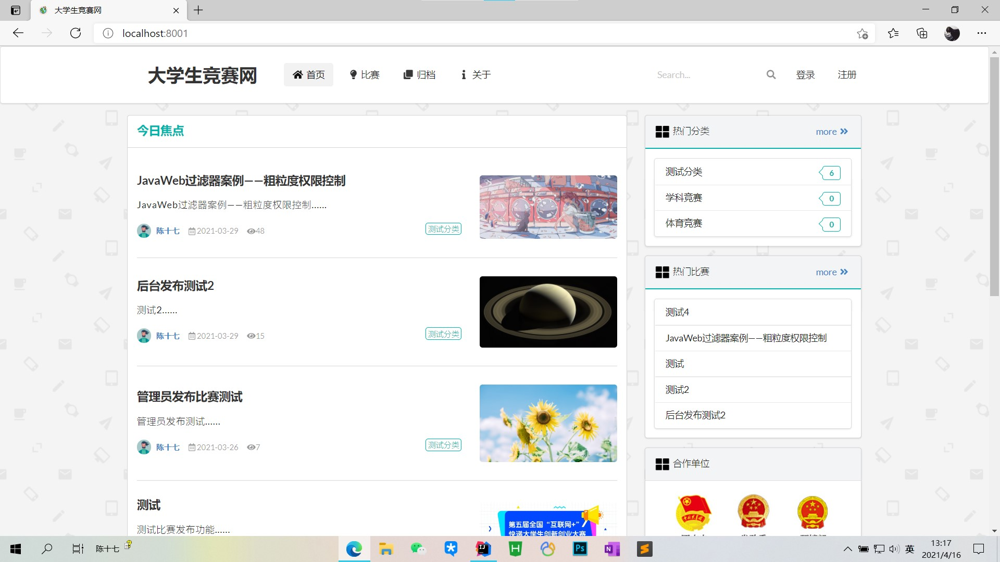

# 竞赛报名系统


## 项目说明

本项目为毕业设计，现已开源，有任何问题欢迎提issues获取发送邮件。

tips：垃圾本科毕设项目，不值一提。

ps：该项目不需要sql脚本，在使用MySQL数据库新建数据库，然后将数据库名称填到yml配置文件中即可，Hibernater会自动生成对应的表。

### 介绍

**竞赛报名系统，毕业设计项目。**

> 地址：（项目升级为博客项目，同款前端）演示地址：https://chenetchen.ltd

> 项目相关博客：暂无

> Bilibili视频地址：[Java毕业设计-竞赛报名系统](https://www.bilibili.com/video/BV1Z64y1X7ge?share_source=copy_web)

该系统采用IntelliJ IDEA，使用Spring Boot框架基于MVC框架进行开发，使用MySQL数据库，利用HTML，JavaScript，Ajax，Thymeleaf模板引擎和Semantic UI完成界面设计。

### 技术框架
- IntelliJ IDEA 2021.1
- Spring Boot 2.4.2
- MySQL 8.0.21
- Redis 3.2.100
- Spring Data JPA
- Hibernate
- Spring Security
- Thymeleaf
- Semantic UI
- Editor.md
- Tocbot.js
- QRCode.js
- Waypoint.js

### 目录说明
```text
src/main/java/com/hunau/competition
- aspect                  日志配置
- config                  配置类
- controller              控制层
- dao                     数据访问层
- domain                  实体类
- handler                 异常处理
- interceptor             拦截过滤
- service                 业务层
- utils                   工具类
CompetitionApplication    启动类

src/main/resources
- i18n                    国际化资源
- static                  静态资源
- templates               页面模板
application.yml           配置文件

log                       日志文件

competition_web.sql       数据库文件
```

## 免责声明
该项目中的内容仅供技术研究与学习，不作为任何结论性依据，不提供任何商业化应用授权。
